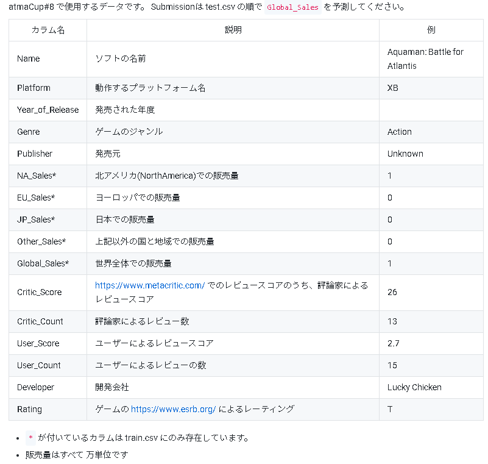

# atmacup8

https://www.guruguru.science/competitions/13/

## OverView
 - ゲームの情報を使って、ゲームの売上を予測します。使えるデータに関しては data sources から閲覧できます。
 
 
## Data
 - HP引用
 
 
## LOG
### 20201208
 - たわらさんのディスカッション[url](https://www.guruguru.science/competitions/13/discussions/cbb736e9-f0f7-4847-811e-fe038e8ed0e8/)
 - 今回の評価指標はRMSLEを最小化することであるが、めんどくさいらしい。LightGBMは実装されていない。
 - CatBoostにはあるらしい
 - CatBoostとアンサンブルはどや？[gotoさんが別のコンペで実装したやつ？](https://www.guruguru.science/discussions/69c83586-247b-4f7b-b2ea-1f90d26e5367/)
 - [hakubishinさんのディスカッション](https://www.guruguru.science/competitions/13/discussions/a65624c2-5eb8-4a1e-be1c-20b92f5136ec/)
  - LightGMBはstringの入力を受け付けないらしい
  - targetをビンニングしてStratifiedKFold が重要っぽい(binの間隔は？)
 - https://www.guruguru.science/competitions/13/discussions/386fb2ed-f0a6-4706-85ba-7a03fedea375/
 - pandas-profilingがGoogleColabでできなくて出てきたQiita(wakameさんだ)[url](https://qiita.com/wakame1367/items/39faf5d91e20a5cf5772#_reference-a12e589891bdd7bf36e5)
   - 全然profileできねぇじゃねえか！...と思ったらwakameさんのipynbはそのままだと動くわ...
   - wakameさんのurlにいくとcsvで出てくるけど、俺のは普通にHPだ。これを明日何とかしよ
